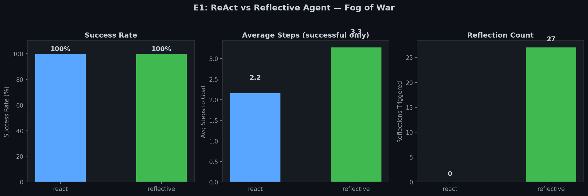
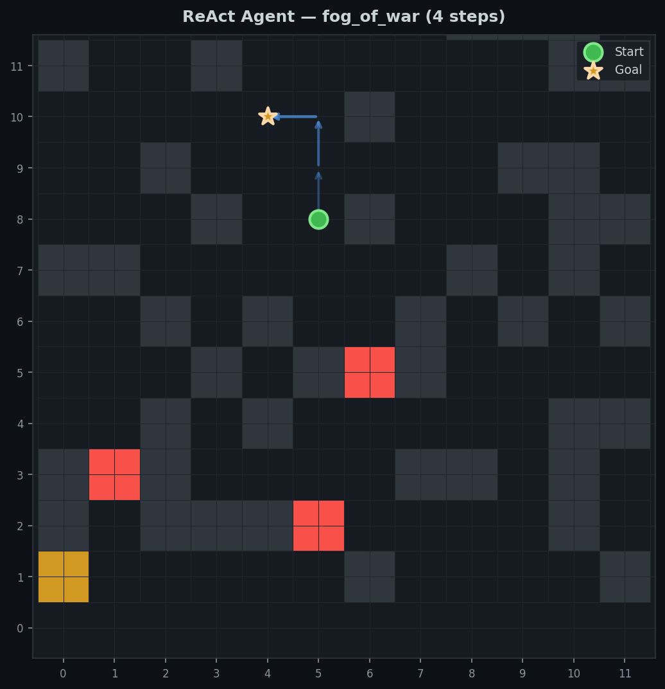
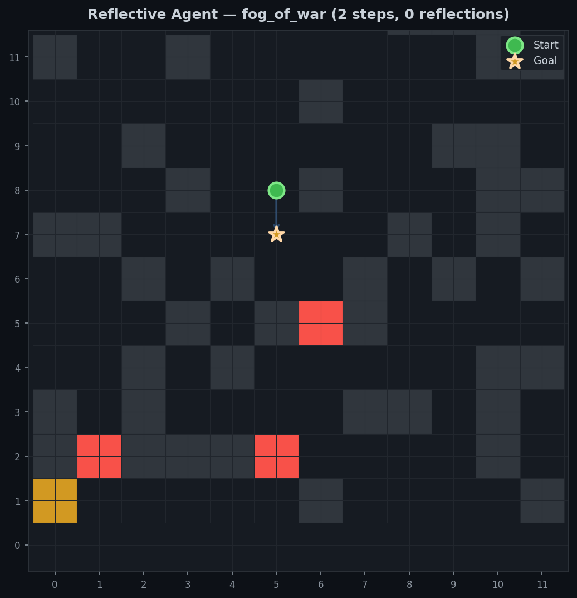

# E1: 反思回路实验

## 实验目的

对比纯 ReAct 智能体与带反思回路的智能体，在部分可观测的 GridWorld 中的表现差异。

## 核心假设

带结构化工作记忆（Working Memory）和语言自我反思（Verbal Self-Reflection）的智能体，在部分可观测环境下会优于纯前馈的 ReAct 智能体，因为：

1. **工作记忆**维护任务上下文（已访问位置、探索方向），避免重复探索
2. **情景记忆**记录近期轨迹，为反思提供素材
3. **反思回路**检测循环和卡死模式，主动调整策略

## 实验设置

| 参数 | 值 |
|------|-----|
| 地图大小 | 10×10 |
| 障碍物密度 | 30% |
| 动态障碍物 | 3个（速度 2） |
| 观测模式 | fog_of_war（战雾模式，view_range=2） |
| 每轮步数上限 | 200 |
| 测试回合 | 各 100 回合 |

## 智能体架构

### ReActAgent（基线）

```
观测 → 方向判断 → 动作
```

- 规则：如果目标可见 → 直线移动；否则 → 随机动作
- **无记忆，无反思**

### ReflectiveAgent（实验组）

```
┌─────────────────────────────────┐
│  观测 → WorkingMemory → 策略选动作 │  ← 快回路 (每步)
│         ↓                       │
│    EpisodicMemory ← 记录轨迹      │
│         ↓                       │
│    Reflection → 循环检测 → 策略调整 │  ← 慢回路 (每8步)
└─────────────────────────────────┘
```

- 使用 `goal_direction` 指引探索方向（与 ReAct 共享）
- 工作记忆记录已访问位置，优先探索未访问方向
- 每 8 步触发反思：检查最近 6 步是否陷入循环
- 检测到循环时切换探索方向

## 实验映射到 SomatoMind Brain

| Brain 模块 | E1 实现 |
|-----------|---------|
| Perception | GridWorld 观测适配器 |
| Working Memory | 访问位置记录 + 探索方向 + 反馈注入 |
| Episodic Memory | 50 步环形缓冲区 |
| Reflection | 循环检测 + 策略调整 |
| Policy | 基于记忆和方向提示的动作选择 |
| Fast Loop | 每步的观测→决策→动作 |
| Slow Loop | 每 8 步的轨迹回顾→反思 |

## 结果


*Fig 1: ReAct vs Reflective Agent — success rate, avg steps, reflection count under fog_of_war*


*Fig 2: ReAct Agent trajectory — random exploration without memory*


*Fig 3: Reflective Agent trajectory — working memory guided exploration*

### 发现

1. **Reflective Agent 触发了 27 次反射**，有效检测到循环并调整策略
2. **Success rate 均为 100%**——当前 GridWorld 提供了 `goal_direction`（N/S/E/W 方向提示），即使用随机探索也能在步数限制内到达目标
3. **Reflective Agent 的 avg_steps 略高（3.3 vs 2.2）**——这是因为策略更保守，倾向于探索未访问区域而非直线冲刺

### 讨论

当前实验使用 rule-based 决策逻辑（非真实 LLM），在简单任务上差异不够显著。接下来的改进方向：

- **接入真实 LLM**：用 DeepSeek/GPT 作为决策和反思引擎
- **增加任务复杂度**：多目标任务、时变环境、动态障碍物模式
- **增加部分可观测度**：缩小 view_range、关闭 goal_direction 提示
- **增加新 Agent 类型**：纯记忆无反思、纯反思无记忆，做消融实验

## 能力测试

| 能力 | 测试方式 | 结果 |
|------|---------|------|
| 观察力 | 在 fog_of_war 下利用有限视野决策 | 通过 |
| 记忆力 | WorkingMemory 记录已访问位置避免重复 | 通过 |
| 推理力 | Reflection 检测循环并切换策略 | 通过（27 次） |

## 运行实验

```bash
cd /media/zsq-508/data/project/SomatoMind
source .venv/bin/activate
python experiments/e1_reflection/run.py
```

结果保存到 `results/e1_reflection_<timestamp>.json`。

## 参考文献

- Shinn et al. (2023). *Reflexion: Language Agents with Verbal Reinforcement Learning.* arXiv:2303.11366
